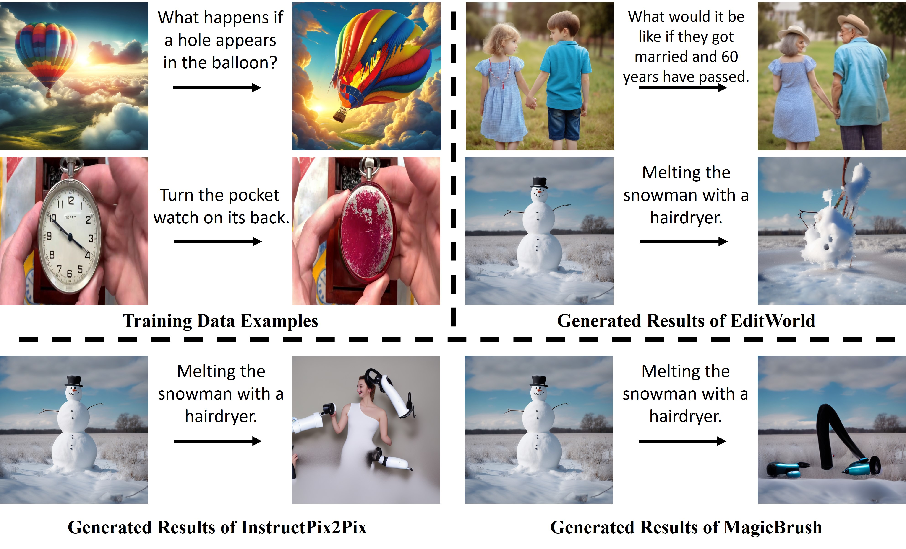
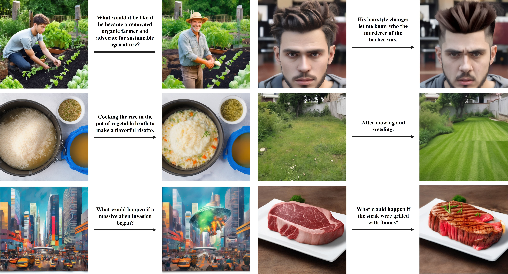

# EditWorld: Simulating World Dynamics for Instruction-Following Image Editing

## Overview

This repository contains the official implementation of our [EditWorld](https://arxiv.org/abs/2405.14785). In this work, we introduce a new task namely **world-instructed image editing**, which defines and categorizes the instructions grounded by various world scenarios. We curate a new image editing dataset with world instructions using a set of large pretrained models (e.g., GPT-3.5, Video-LLava and SDXL). We also propose a new post-edit method for world-instructed image editing.

### World Instruction *vs*. Traditional Instruction


### Generated Results of Our EditWorld:



## Planning 
  - [√] Providing full pipeline of text-to-image generation for EditWorld dataset.
  - [ ] Releasing evaluation dataset in next two weeks.
  - [ ] Releasing Checkpoints.
  - [ ] Releasing training and post-edit code.

## Codebase

### Text-to-image generation branch

Firstly, we employ GPT-3.5 to provide textual quadruples:

```shell
python gpt_script/text_img_gen_aigcbest_full.py --define_json gpt_script/define_sample_history/define_sample.json --output_path gpt_script/gen_sample_history/ --output_json text_gen.json
```

Then, we transform the text prompt provided by GPT into dict:

```shell
python tools/deal_text2json.py --input_json gpt_script/gen_sample_history/text_gen.json --output_json text_gen_full.json
```

Finally, we obtain the input-instruct-output triples based on the generated textual quadruples:

```shell
python t2i_branch_base.py --text_json text_gen_full.json --save_path datasets/editworld/generated_img/
```

It is worth noting that `t2i_branch_base.py` is the fast and basic version for text-to-image generation branch, we will improve this part in the future.

### Video branch

Path `video_script` contains the code for downloading videos from the [InternVid](https://huggingface.co/datasets/OpenGVLab/InternVid).

## Dataset structure

To obtain the training dataset file `train.json`, utilize the script located at `tools/obtain_datasetjson.py`. The dataset is organized in the following structure:

```css
datasets/
├── editworld/
│   ├── generated_img/
│   │   ├── group_0/
│   │   │   ├── sample0_ori.png
│   │   │   ├── sample0_tar.png
│   │   │   ...
│   │   │   └── img_txt.json
│   │   └── group_1/
│   │   ...
│   ├── video_img/
│   │   ├── group_0/
│   │   │   ├── sample0_ori.png
│   │   │   ├── sample0_tar.png
│   │   │   ...
│   │   │   └── img_txt.json
│   │   └── group_1/
│   │   ...
│   └── human_select_img/
│       ├── group_0/
│       │   ├── sample0_ori.png
│       │   ├── sample0_tar.png
│       │   ...
│       │   └── img_txt.json
│       └── group_1/
│       ...
└── train.json
```

## Citation
```
@article{yang2024editworld,
  title={EditWorld: Simulating World Dynamics for Instruction-Following Image Editing},
  author={Yang, Ling and Zeng, Bohan and Liu, Jiaming and Li, Hong and Xu, Minghao and Zhang, Wentao and Yan, Shuicheng},
  journal={arXiv preprint arXiv:2405.14785},
  year={2024}
}
```